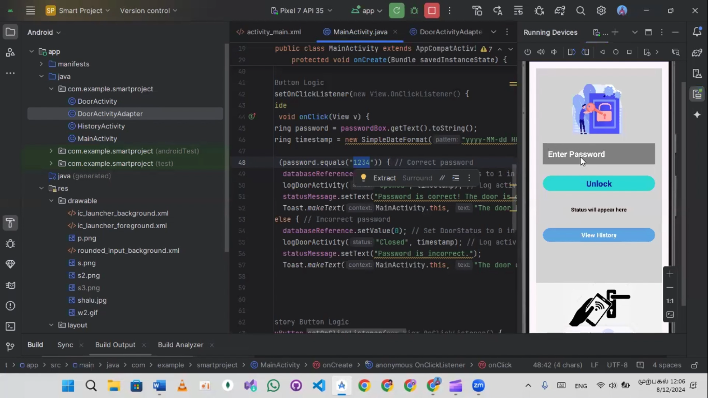
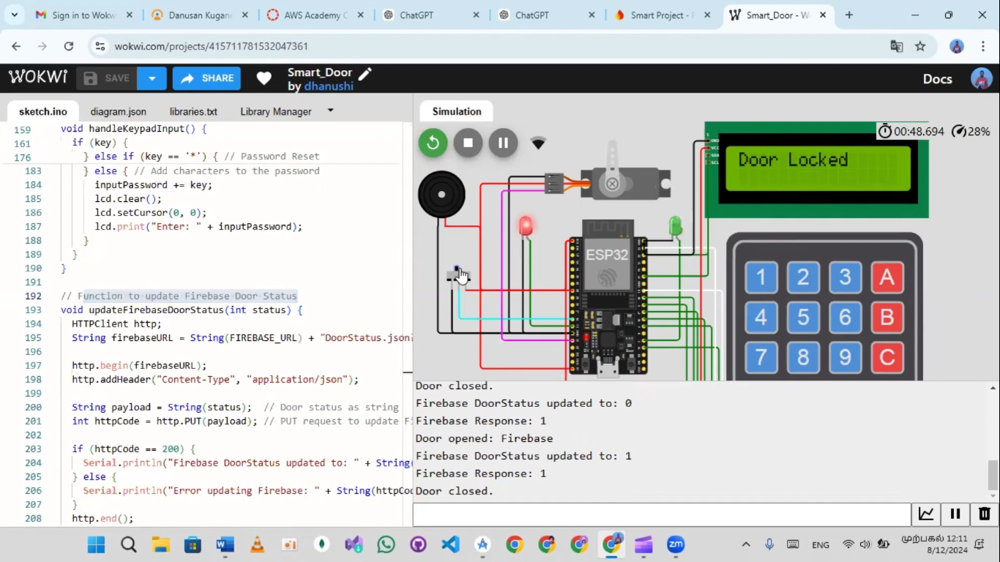
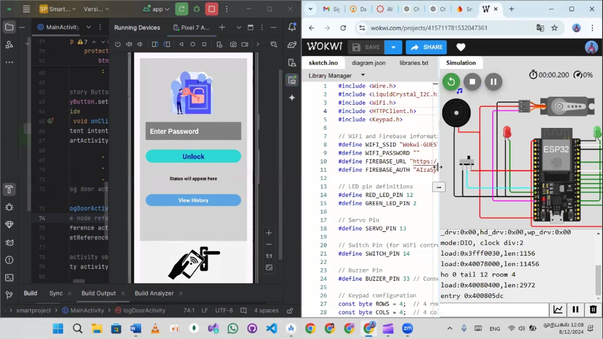
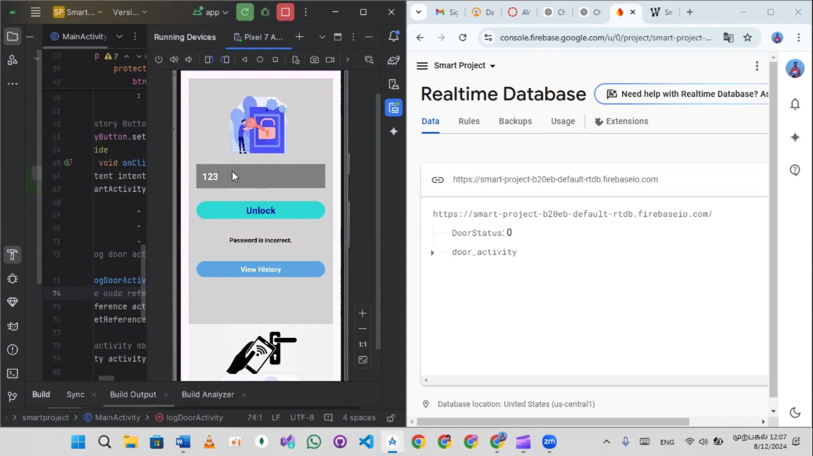
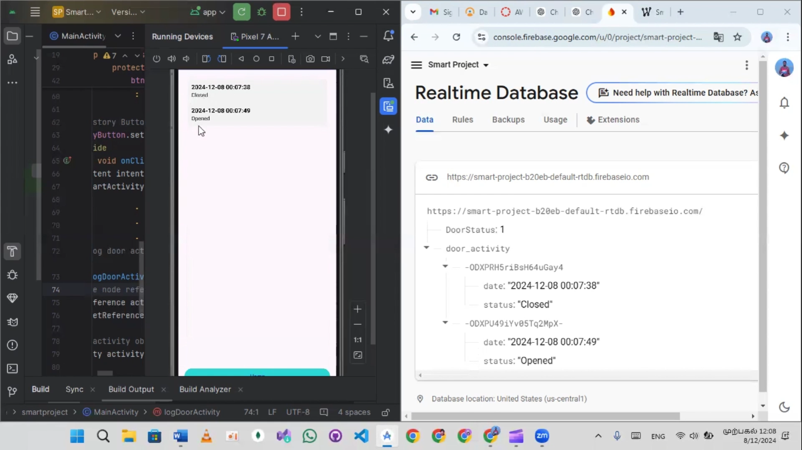

# EntryControl360 - Smart Door Management System

**EntryControl360** is a mobile application that allows house owners to unlock their door both remotely via a mobile app (using Firebase) and physically (via a keypad). It provides real-time logging of door activity and displays a history of all interactions through a Firebase-backed system.

---

## Objective

The objective of this system is to provide a **Smart Door Management System** where:

- The door can be unlocked using a correct password from the mobile app, and the activity is logged.
- The app stores door activity (opened/closed) with timestamps into Firebase.
- The door activity history is displayed in a separate activity within the app.

---

## Core Features

### MainActivity:
- **Password Validation**: Allows users to unlock the door by entering a password on the mobile app.
- **Activity Logging**: Logs the door’s status (opened or closed) along with the timestamp into Firebase Realtime Database.
- **History Navigation**: A button that navigates users to the `HistoryActivity` to view the door activity history.

### HistoryActivity:
- **Activity History Display**: Displays a list of door activities in a `RecyclerView`, fetching data from Firebase in real-time.

---

## Technologies Used

- **Firebase**: Used for real-time data storage and retrieval to track door activity status.
- **Android Components**: Activities, RecyclerView, Intents for UI and navigation.
- **Realtime Database**: Logs door activity with timestamps.

---

## Key Steps

1. **Data Logging**:
   - Door activity (status: 1 for open, 0 for closed) is logged to Firebase Realtime Database under the `door_activity` node.
   - The system records timestamps for each event.

2. **History Display**:
   - Door activity data is fetched from Firebase and displayed in `HistoryActivity` using `RecyclerView`.

3. **UI Design**:
   - The app’s main screen includes buttons for **Unlock** and **View History**.
   - The UI is organized with clear separation of functionalities.

---

## Challenges Overcome

- **Firebase Node Structure**: Ensured the correct data structure for storing and retrieving door activities in Firebase.
- **Real-time Data Binding**: Handled Firebase real-time data binding issues for consistent UI updates.
- **Navigation & UI**: Designed smooth navigation between `MainActivity` and `HistoryActivity`.

---

## Outcome

- A fully functional **Smart Door Management System**.
- **Password-protected access** to unlock the door with real-time logging of door activities.
- Display of **historical door activity** with timestamp details.

---

## Future Scope

- **User Authentication**: Integrating user authentication to personalize activity history and security.
- **Enhanced UI/UX**: Improve the app’s look and feel with Material Design components.
- **Push Notifications**: Add notifications for door activity events (open/close).

---

## Screenshots

Here are some screenshots of the **EntryControl360** app:

1. **Main Screen** - The main screen where the user can unlock the door or view history.
   

2. **Unlock Door Screen** - The screen where the password is entered to unlock the door.
   

3. **History Screen** - The history screen displaying all door activity logs.
   

4. **Password Validation Success** - A screenshot of the door being successfully unlocked.
   

5. **Door Activity Log** - A screenshot showing the door activity log in the app.
   

---

## Setup Instructions

To set up the project locally:

1. **Clone the repository**:
   ```bash
   git clone https://github.com/yourusername/EntryControl360.git

2. Install dependencies: Open the project in Android Studio, and it will automatically download necessary dependencies.

3. Firebase Configuration:
   Go to Firebase Console.
   Create a new project.
   Add Firebase to your Android app.
   Replace the google-services.json file in the app with your own Firebase credentials.

4. Run the Application:
   Connect your Android device or use an emulator.
   Run the app and test unlocking functionality, logging, and viewing activity history.
   License

This project is licensed under the MIT License - see the LICENSE file for details.

Acknowledgements
  Firebase for real-time database functionality.
  Android Studio for the development environment.
  Material Design guidelines for UI/UX enhancements.
